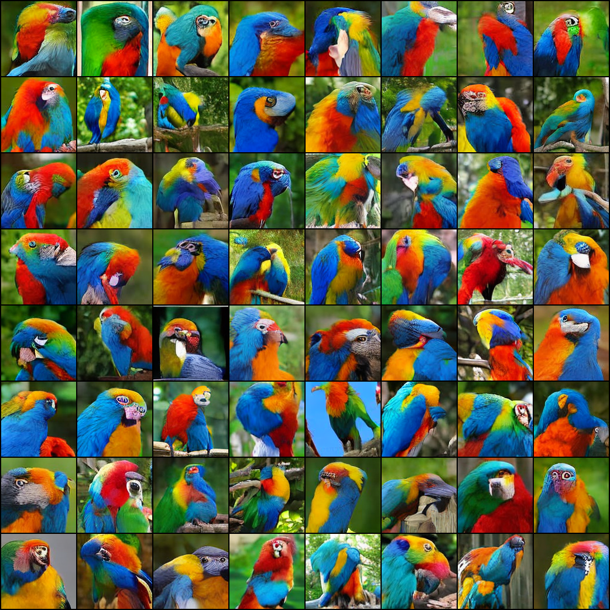
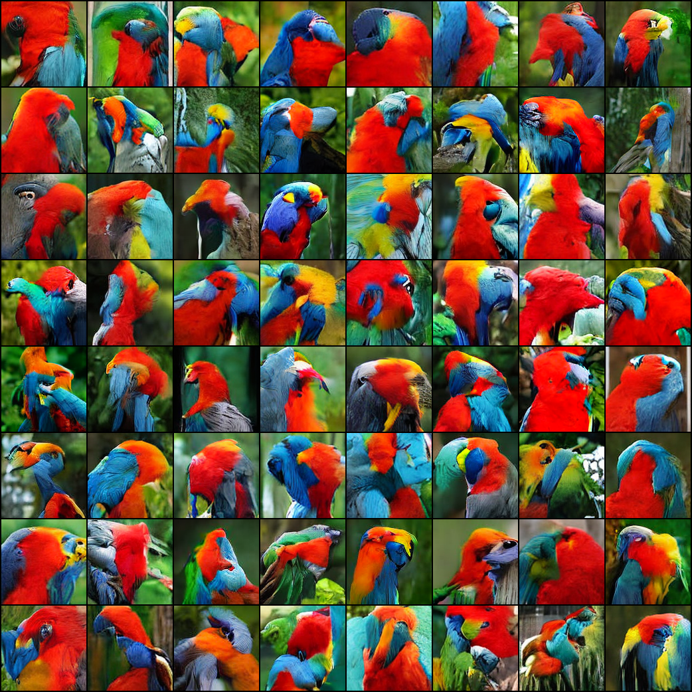

# Diffusion Transformer (DiT) with Magnitude-Preserving Layers
This project builds upon key concepts from the following research papers:
 - [Magnitude preservation paper](https://arxiv.org/abs/2312.02696)
 Introduces the idea of preserving the magnitude of features during the diffusion process, enhancing the stability and quality of generated outputs.
 - [DiT paper](https://arxiv.org/abs/2212.09748)
Explores the application of Transformer architectures to diffusion models, achieving state-of-the-art performance on various generation tasks.

## Preliminary Results

Below, we present our preliminary results when sampling the **DiT-S/2 model** with **magnitude preservation** (Fig. 1) and without (Fig. 2). 

<div style="display: flex; justify-content: space-between; gap: 20px;">
    <figure style="width: 48%; text-align: center; margin: 0;">
        
        <figcaption style="margin-top: 8px;"><b>Fig. 1:</b> DiT-S/2 with magnitude preservation</figcaption>
    </figure>
    <figure style="width: 48%; text-align: center; margin: 0;">
        
        <figcaption style="margin-top: 8px;"><b>Fig. 2:</b> DiT-S/2 (standard model)</figcaption>
    </figure>
</div>


## Training

```bash
python train.py --data-path /path/to/data --results-dir /path/to/results --model DiT-XS/2
```

## Sampling

```bash
python sample.py --result-dir /path/to/result --ckpt <checkpoint>.pt --class-label 2 --seed 42 --cfg-scale 1.5
```
