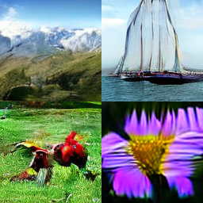
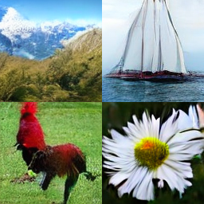
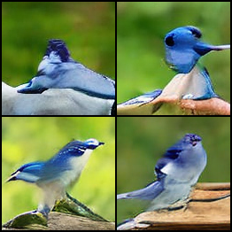
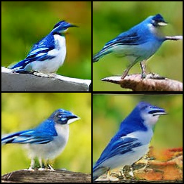
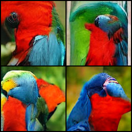
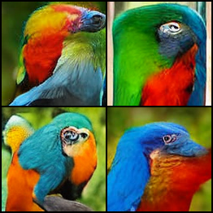
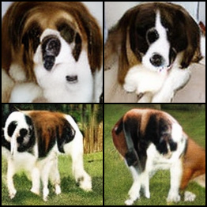
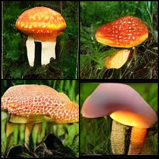
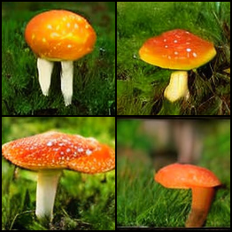

# The Art of Balance: Magnitude Preservation in Diffusion Transformers
## [📝Paper](https://ericbill21.github.io/MP_in_DiT.pdf)
We extend magnitude-preserving techniques from the EDM2 architecture to Diffusion Transformers (DiT), ensuring stable training by maintaining activation magnitudes and controlling weight growth throughout the architecture. Additionally, we incorporate power function-based exponential moving averages, enabling flexible post-training reconstruction with adjustable decay parameters. Experiments on DiT-XS/2 and DiT-S/4 show significant improvements in FID-10K, highlighting the effectiveness of our approach. Despite increased computational overhead, our methods offer a scalable and modular solution for transformer-based diffusion models.

<p align="center">
  
  &nbsp; &nbsp; &nbsp; &nbsp; &nbsp; &nbsp; &nbsp; &nbsp;
  
  <p align="center"><b>Fig 1.</b> DiT-S/4 samples without (left) and with (right) magnitude preserving layers.</p>
</p>

This project builds upon key concepts from the following research papers:
 - [Peebles & Xie (2023)](https://arxiv.org/abs/2212.09748) explore the application of transformer architectures to diffusion models, achieving state-of-the-art performance on various generation tasks;
 - [Karras et al. (2024)](https://arxiv.org/abs/2312.02696) introduce the idea of preserving the magnitude of features during the diffusion process, enhancing the stability and quality of generated outputs.

<!-- ## Preliminary Results

Below, we present some preliminary results of using magnitude preservation (right) _vs._ not using magnitude preservation (left) with DiT-S/2 on the ImageNet-128 dataset. Note that DiT-S/2 is a very small model, so the samples are not of high quality. However, MaP-DiT displays much higher quality and consistency than vanilla DiT.

<p align="center">
  
  &nbsp; &nbsp; &nbsp; &nbsp; &nbsp; &nbsp; &nbsp; &nbsp;
  
  <p align="center"><b>Fig 1.</b> DiT-S/2 samples of <em>Jay</em> without (left) and with (right) magnitude preserving layers.</p>
</p>

<p align="center">
  
  &nbsp; &nbsp; &nbsp; &nbsp; &nbsp; &nbsp; &nbsp; &nbsp;
  
  <p align="center"><b>Fig 2.</b> DiT-S/2 samples of <em>Macaw</em> without (left) and with (right) magnitude preserving layers.</p>
</p>

<p align="center">
  
  &nbsp; &nbsp; &nbsp; &nbsp; &nbsp; &nbsp; &nbsp; &nbsp;
  
  <p align="center"><b>Fig 3.</b> DiT-S/2 samples of <em>St. Bernard</em> without (left) and with (right) magnitude preserving layers.</p>
</p>

<p align="center">
  
  &nbsp; &nbsp; &nbsp; &nbsp; &nbsp; &nbsp; &nbsp; &nbsp;
  
  <p align="center"><b>Fig 4.</b> DiT-S/2 samples of <em>Mushroom</em> without (left) and with (right) magnitude preserving layers.</p>
</p> -->

## Training

```bash
python train.py --data-path /path/to/data --results-dir /path/to/results --model DiT-S/2 --num-steps 400_000 <map feature flags>
```

### Magnitude Preservation Flags
Customize the training process by enabling the following flags:
- `--use-cosine-attention` - Controls weight growth in attention layers.
- `--use-weight-normalization` - Applies magnitude preservation in linear layers.
- `--use-forced-weight-normalization` - Controls weight growth in linear layers.
- `--use-mp-residual` - Enables magnitude preservation in residual connections.
- `--use-mp-silu` - Uses a magnitude-preserving version of SiLU nonlinearity.
- `--use-no-layernorm` - Disables transformer layer normalization.
- `--use-mp-pos-enc` - Activates magnitude-preserving positional encoding.
- `--use-mp-embedding` - Uses magnitude-preserving embeddings.

## Sampling

```bash
python sample.py --result-dir /path/to/results/<dir> --class-label <class label>
```

## Citation

```bibtex
@misc{bill_jensen_2025,
    title={The Art of Balance: Magnitude Preservation in Diffusion Transformers},
    author={Eric Tillmann, Bill and Cristian Perez, Jensen},
    howpublished = {\url{https://github.com/ericbill21/map-dit}},
    year={2025}
}
```